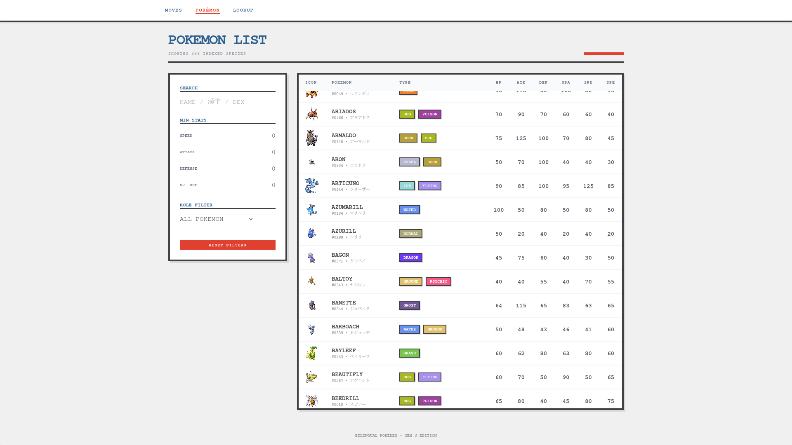
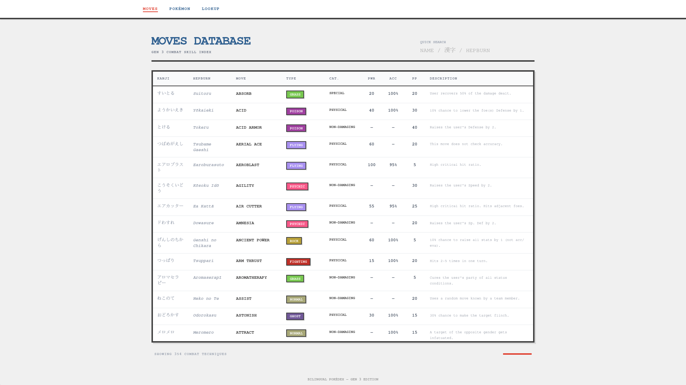
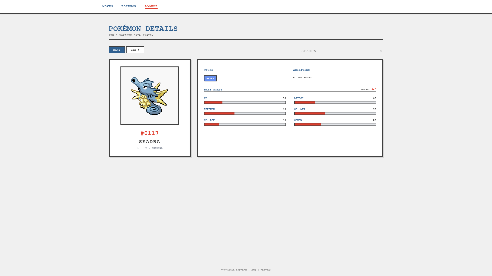

# Generation III Pokémon Explorer

A bilingual web app that makes exploring Generation III Pokémon effortless in both English and Japanese. Search by English name, Japanese Kanji, or Hepburn romanization—something you won't find anywhere else in one place.

## What Makes This Special

Most Pokémon resources make you choose between English or Japanese, or force you to navigate multiple pages to see both languages. This app puts everything side-by-side, making it perfect for language learners, nostalgic players, or anyone curious about the original Japanese names and details.

## Features

- **Bilingual Search**: Find any Generation III Pokémon or move by typing in English, Japanese characters, or romanized Japanese
- **All 386 Pokémon**: Browse complete stats, abilities, types, and names in both languages
- **354 Moves**: Full move list with power, accuracy, categories, and descriptions
- **Beautiful Detail Views**: See Pokémon sprites alongside stat bars and bilingual information

## Getting Started

### You'll Need

- Node.js (version 16 or higher)
- Python 3.x (just for the initial data collection)

### Quick Setup

1. **Get the Pokémon data**
   ```bash
   python3 -m venv venv
   source venv/bin/activate
   pip install -r requirements.txt
   python scrape.py
   ```

2. **Launch the app**
   ```bash
   cd pokedex
   npm install
   npm run dev
   ```

3. **Start exploring** at `http://localhost:5173`

## Screenshots





## Project Structure

```
gen3-bilingual-pokedex/
├── pokedex/                 # Main React app
│   ├── src/
│   │   ├── app/             # App configuration
│   │   ├── assets/          # Images and static files
│   │   ├── components/      # UI components
│   │   ├── domain/          # Business logic
│   │   ├── lib/             # Utilities and helpers
│   │   ├── pages/           # Page components
│   │   └── styles/          # CSS and styling
│   └── package.json
├── scraped_data/            # CSV data files
│   ├── abilities.csv
│   ├── items.csv
│   ├── jp_abilities.csv
│   ├── jp_items.csv
│   ├── jp_moves.csv
│   ├── jp_names.csv
│   ├── moves.csv
│   └── pokemon.csv
├── python/                  # Python code mainly for data scraping/cleaning
│   ├── app.py               # Streamlit prototype for front-end
│   ├── csv_to_json.py
│   ├── scrape.py
│   ├── scrape_functions.py
│   └── verify_data.py
├── requirements.txt
└── README.md
```

## License

MIT
